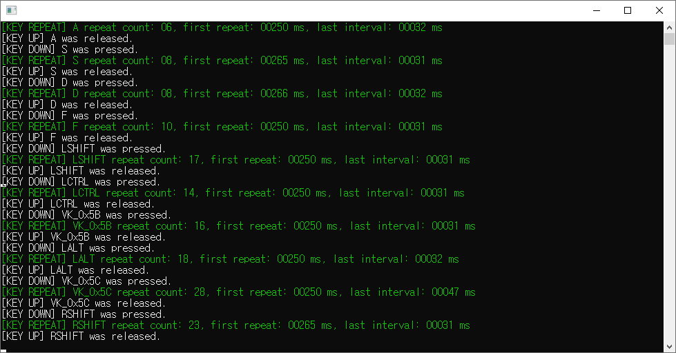
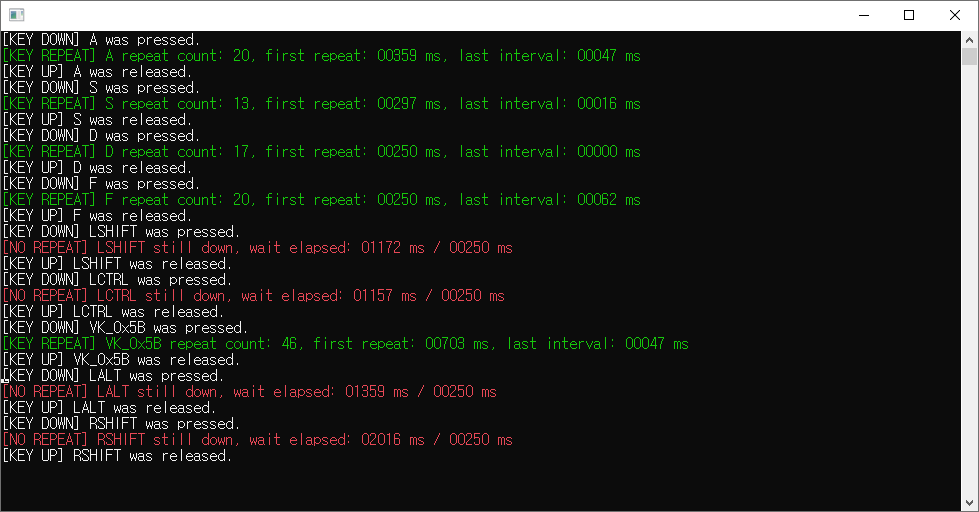
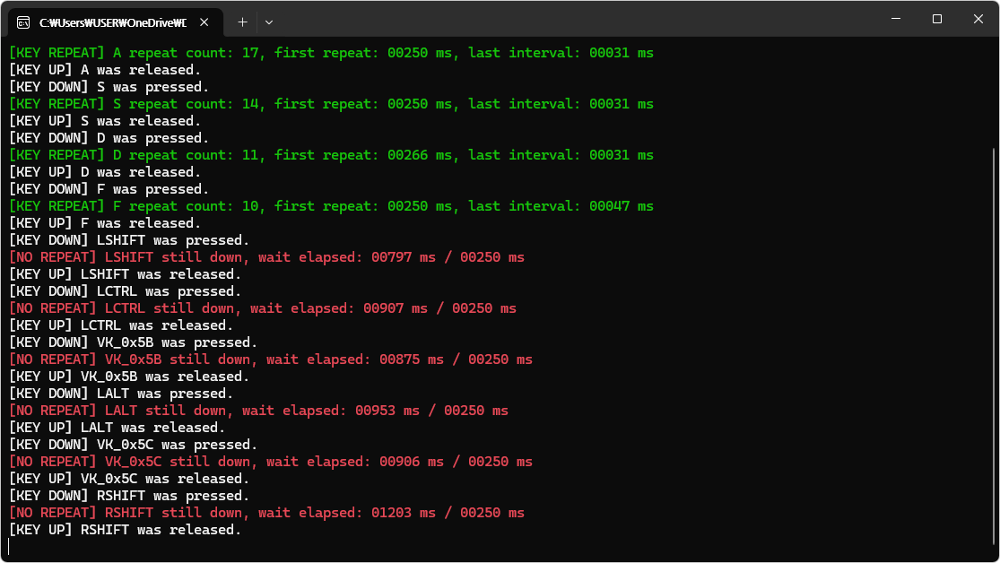

# AutoCAD & Windows 11 Key Repeat Fix

This repository provides tools to resolve the issue where functional key repeat signals (Shift, Ctrl, Alt) are missing in certain environments, such as recent Windows 11 updates or laptop power-saving firmwares, causing issues in applications like AutoCAD.

> **Note:** The original AutoHotkey script (`AutoCAD_ShiftFix.ahk`) has been moved to the `AutoHotkey` folder.

## ⚠️ The Problem

After recent Windows 11 updates (around March 2026), users have reported that temporary overrides in AutoCAD (e.g., toggling Ortho mode by holding Shift) no longer function correctly.

The root cause lies in a change in how Windows and certain hardware handle keyboard input. 
Normally, pressing a key sends a `key_down` signal, and holding it should trigger periodic repeat `down` signals until the `key_up` signal is sent. However, many laptop power-saving firmwares and recent Windows 11 updates now suppress these repeat signals for L/R Shift, Left Ctrl, Left Alt, and L/R Win keys, sending only a single `down` and `up` signal.

**Why AutoCAD fails:**
AutoCAD determines if the Shift key is being "held" by checking if it receives at least two consecutive `Shift down` signals. Since the modified environment only sends a single `down` signal, AutoCAD fails to recognize the held state, and the temporary override function fails.

### 🔍 Validation Data
Below are the timing results of key inputs captured using the included `KeyRepeatTester`:

* **Windows 10 Desktop Keyboard:** Normal `[KEY REPEAT]` signals are generated.  
  
  
* **Windows 10 Notebook:** Repeat signals are suppressed (`[NO REPEAT]`) due to power-saving features.  
  
  
* **Windows 11 (Recent Update):** Repeat signals for Shift, Ctrl, and Alt are blocked even on desktop environments.  
  
  
---

## 🛠️ The Solutions

To bypass these limitations and restore normal keyboard behavior, we provide three C++ based applications. Choose the one that best fits your needs.

### 1. AcadShiftFix (AutoCAD Specific)
A specialized fix optimized for the AutoCAD environment.
* **Mechanism:** Operates only when `acad.exe` or `acadlt.exe` is the active foreground window. If a Shift key press is detected but no repeat signal is received within the system's defined delay, the program manually injects an additional Shift `down` signal. This allows AutoCAD to correctly detect the held state.
* **Usage:**
  * **Auto-Start:** Run `AcadShiftFix_Setup.exe` to install it as a background service that starts with Windows.
  * **Standalone:** Run `AcadShiftFix.exe` to use it only for the current login session.

### 2. KeyRepeatAssist (Universal Purpose)
A system-wide utility that applies to all active windows, not just AutoCAD.
* **Mechanism:** Monitors L/R Shift, Left Ctrl, and Left Alt (4 keys total). It intervenes only when a key is physically held down but the hardware/OS fails to generate repeat signals, manually injecting signals to mimic standard keyboard behavior.
* **Usage:** Useful for any application where held-key shortcuts are malfunctioning.
  * **Auto-Start:** Install via `KeyRepeatAssist_Setup.exe`.
  * **Standalone:** Run `KeyRepeatAssist.exe` directly.

### 3. KeyRepeatTester (Diagnostic Tool)
A console application to verify if your PC environment is affected by the key repeat issue.
* **Mechanism:** Reads the system's `KeyboardDelay` and `KeyboardSpeed` settings and displays real-time logs of key input timings.
* **Usage:** Run `KeyRepeatTester.exe` and hold down a key to see if `[KEY REPEAT]` or `[NO REPEAT]` is logged in the console.
  
              

# AutoCAD 및 윈도우 11 키 반복 문제 해결

이 저장소는 AutoCAD를 포함한 노트북 및 윈도우 11 환경에서 발생하는 기능 키(Shift, Ctrl, Alt, Win)의 반복 입력 누락 문제를 해결하기 위한 도구들을 제공합니다.

> **참고:** 기존에 제공되던 AutoHotkey 스크립트(`AutoCAD_ShiftFix.ahk`)는 `AutoHotkey` 폴더로 이동되었습니다.

## ⚠️ 문제 원인 (The Problem)

최근(2026년 3월경) 배포된 윈도우 11 업데이트 이후, Shift 키를 누른 상태로 직교 모드를 임시 변경하는 등의 기능이 AutoCAD에서 정상적으로 동작하지 않는 문제가 발생하고 있습니다.

이 문제의 근본 원인은 윈도우와 하드웨어의 키보드 입력 처리 방식 변화에 있습니다.  
일반적으로 키를 누르면 `key_down`, 떼면 `key_up` 신호가 전달되며, 키를 누르고 있을 경우 `down` 신호가 주기적으로 발생해야 합니다.  
하지만 일부 노트북과 최근 윈도우 11 업데이트 환경에서는 좌/우 Shift,Ctrl,Alt,Win키의 반복 신호를 생략하고 `down` 신호를 1회만 전달합니다.

**AutoCAD 오작동 이유:**  
AutoCAD는 Shift 키가 지속적으로 눌린 상태인지를 판단할 때, `Shift down` 신호가 최소 2회 이상 연속으로 들어오는지를 기준으로 삼습니다.  
따라서 `down` 신호가 1회만 전달되는 환경에서는 AutoCAD가 키 눌림을 인식하지 못해, 임시 재지정(직교 등) 기능이 실패하게 됩니다.

### 🔍 테스트 및 검증 자료
아래는 첨부된 `KeyRepeatTester`를 사용하여 실제 키 입력 타이밍을 확인한 결과입니다.

* **Windows 10 데스크탑 키보드:** 정상적으로 키 반복(`KEY REPEAT`) 신호가 발생함.  
  
  
* **Windows 10 노트북:** 절전 기능 등으로 인해 반복 신호 생략(`NO REPEAT`) 현상 발생.  
  
  
* **Windows 11 (최근 업데이트):** 데스크탑 환경임에도 좌/우 Shift, 좌측 Ctrl, 좌측 Alt 키의 반복 신호가 차단됨.  
  
  
---

## 🛠️ 해결 방법 및 공개 프로그램

이러한 문제를 우회하고 정상적인 키보드 환경을 복구하기 위해 3가지 C++ 기반 프로그램을 공개합니다. 상황과 목적에 맞게 선택하여 사용하세요.

### 1. AcadShiftFix (AutoCAD 전용)
AutoCAD 환경에 특화된 수정 프로그램입니다.
* **동작 방식:** `acad.exe` 또는 `acadlt.exe` 프로세스의 창이 활성화된 상태에서만 작동합니다.  
Shift 키가 눌렸을 때 윈도우에 설정된 반복 시간 내에 추가 신호가 감지되지 않으면, 프로그램이 자체적으로 Shift `down` 신호를 한 번 더 보냅니다.  
이를 통해 AutoCAD가 시프트 눌림 상태를 정상적으로 감지하고 임시 재지정 기능이 작동하도록 돕습니다.
* **설치 및 사용:**
  * **자동 실행:** `AcadShiftFix_Setup.exe`로 설치하면 윈도우 시작 시 백그라운드에서 자동으로 실행됩니다.
  * **수동 실행:** `AcadShiftFix.exe`를 단독으로 실행하면 현재 로그인된 세션(환경)에서만 일시적으로 작동합니다.

### 2. KeyRepeatAssist (범용)
특정 프로그램에 국한되지 않고, 현재 활성화된 모든 창에 적용되는 시스템 범용 프로그램입니다.
* **동작 방식:** 좌/우 Shift, 좌측 Ctrl, 좌측 Alt (총 4개 키)를 감시합니다.  
키를 길게 눌렀음에도 반복 신호가 감지되지 않는 경우에만 개입하여 기존 키보드 동작과 동일한 주기로 반복 신호를 발생시킵니다.
* **용도:** AutoCAD뿐만 아니라 단축키 반복 입력이 필요한 다른 애플리케이션에서 문제가 발생할 때 유용합니다.
* **설치 및 사용:**
  * **자동 실행:** `KeyRepeatAssist_Setup.exe`를 설치하여 윈도우 시작 시 백그라운드에서 자동으로 실행됩니다.
  * **수동 실행:** `KeyRepeatAssist.exe`를 단독으로 실행하여 사용할 수 있습니다.

### 3. KeyRepeatTester (진단 및 검증 도구)
사용자의 현재 PC 환경에서 실제로 키 반복 누락 문제가 발생하는지 직접 검증할 수 있는 콘솔 프로그램입니다.
* **동작 방식:** 윈도우 설정의 키 재입력 시간(KeyboardDelay)과 반복 속도(KeyboardSpeed) 값을 읽어옵니다. 이후 사용자가 키를 눌렀을 때 시스템이 어떤 타이밍으로 신호를 받고 있는지, 반복 입력이 정상적으로 발생하는지를 실시간 메시지로 출력합니다.
* **사용법:** `KeyRepeatTester.exe`를 실행하고 진단하고자 하는 키를 꾹 눌러 콘솔 창에 출력되는 로그(`[KEY REPEAT]` 또는 `[NO REPEAT]`)를 확인합니다.